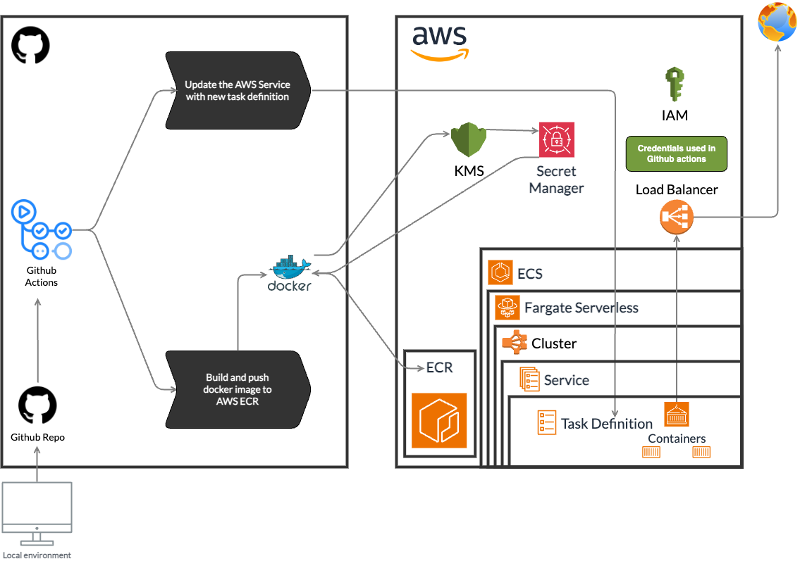

<p align="center"></p>

<h1 align="center">Ecommerce backend with Node.js</h1>

## Test Plans - e2e

- [x] Save a new user as a customer
  - [x] Login with the customer
- [x] Save user cash as debit to the wallet (wallets are user transactions with a entry of debit 'cause the ecommerce is holding the money)
- [x] Save an user as a seller
  - [x] Login with the new seller
- [x] Only seller can save a new article with a price
- [x] Customer tries to buy the article
  - [x] The customer has not enough cash, the article is not bought and the customer has to add enough money in order to buy it
  - [x] The customer has enough cash, the article is bought and its stock is reduced by purchased quantity
- [ ] The seller has received the money from the customer (customer's and seller's wallets are updated after the purchase)
- [ ] The article goes to the customer's account > purchase history (seller's article inventory is updated after the purchase)

## Requirements

- Node.js v18 (use [nvm](https://github.com/nvm-sh/nvm) to manage multiple Node.js versions.)
- Docker (for MongoDB)
- pnpm v8 (minimum)
- Create an `.env` file that looks like the `.env.example` file.
- Seed default sample database records with `pnpm import:db` script then CTRL+C to stop the script.

## Installation

```bash
$ nvm install 18
$ nvm use 18 # Manual call to use the right Node.js version
# Automatic call node version by .nvmrc reference: https://github.com/nvm-sh/nvm#bash, so
# when you open a new terminal, the right Node.js version will be used
$ pnpm install
```

## Running the app

```bash
# development
$ pnpm dev

# production mode
$ pnpm build

# run production build (after build)
$ pnpm start

# download secrets from AWS Secrets Manager
$ pnpm env:dev
```

## Usage

```bash
# run tests
$ pnpm test
# run tests with coverage
$ pnpm test:coverage
# run tests with verbose output
$ pnpm test:verbose
# run tests with watch mode
$ pnpm test:watch
# inspect code linting
$ pnpm lint
# fix code linting
$ pnpm lint:fix
# import default sample database records, be sure
# to have a running mongodb engine running and database empty (with no records)
$ pnpm import:db
```

# CI/CD

<p align="center"></p>

GitHub Actions CI/CD pipeline is configured to run on every push to the `develop` branch. The pipeline will run the following steps:

- Checkout the code
- Configure AWS credentials
- Login to AWS ECR
- Prepare task definition file
- Build the Docker image
- Push the Docker image to AWS ECR
- Use new task definition file to update the ECS service with the new image
- Deploy the application to the ECS service

AWS will be in charge give docker the permissions to download app secrets from AWS Secret Manager using a AWS Key Management Service (KMS) and it will deploy the application to the ECS service inside a ECS Cluster. The ECS service, which use Fargate serverless, is configured to run 2 tasks (2 containers) with the application. Also the ECS service is configured to run behind an Application Load Balancer (ALB) that will be used to route traffic to the application (SSL is not configured). Thus so you can access the application using the ALB DNS name through global internet HTTP protocol.
